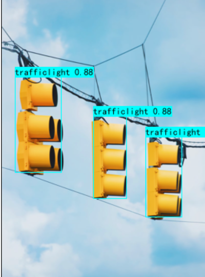

# Tensorflow2实现YOLOv6交通标志检测

此代码是基于 https://github.com/bubbliiiing/yolox-tf2 编写的，大部分保留了源代码。

## 1. 环境配置

- tensorflow-gpu==2.4.0
- opencv-python==4.5.5.62
- numpy==1.19.5
- Pillow==8.4.0
- tensorboard==2.7.0
- tqdm

## 2. 数据准备和处理

数据集地址：https://aistudio.baidu.com/aistudio/datasetdetail/49531

下载之后需要将文件夹格式处理成如下命名格式：

```python
VOCdevkit
	- VOC2007
		- Annotations
		- ImageSets
		- JPEGImages
```

需要修改model_data/cls_classes.txt中的类别，修改为数据集的类别即可。
在准备好之后，运行voc_annotation.py文件会根目录得到两个txt文件里面存放着需要训练的数据。

## 3. 训练步骤

在train.py文件中，修改自己所需参数，train.py中详细的参数设置。
运行train.py即可开始训练

## 4. 预测步骤


权重文件的百度网盘地址：
链接：https://pan.baidu.com/s/1rhS7gROjFwmVc7zrEg7Ppw 

提取码：2aq2 

下载完权重文件之后，在yolo.py文件中，指定model_path，该参数是权重文件的路径
，classes_path是对应类别。

将训练权重放入model_data，运行predict.py，输入需要预测的图片。

预测效果如下：



## 5. 参考

https://github.com/bubbliiiing/yolox-tf2

https://github.com/meituan/YOLOv6


